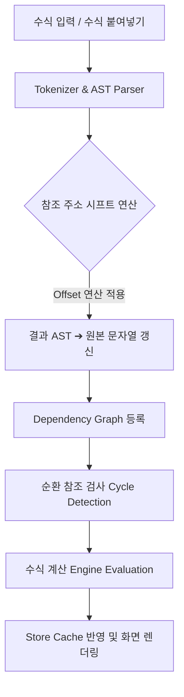

# 엑셀 수식 지원 엔진 고도화 개발 계획서

## 1. 개요 및 목적
본 문서는 기존 고급 그리드 기능 개발 계획서의 4단계인 'Excel형 셀 수식'을 확장하여, 실제 엑셀과 유사한 수준의 **수식 복사/값 복사** 및 **절대 참조/상대 참조** 기능을 포함한 고도화된 수식 엔진을 구축하기 위한 아키텍처 및 구현 스펙을 정의합니다.

## 2. 확장된 지원 문법 (AST 파서 업데이트)

기본 연산자 및 내장 함수(SUM, AVERAGE, IF 등) 외에, 수식 복사 시 오프셋 계산의 기준이 되는 참조 문법을 파서(tokenizer, parser) 스펙에 추가합니다.

* **상대 참조 (Relative Reference)**: `A1`, `B2`, `C1:D10`
  * 수식 복사 시 타겟 셀과의 행(Row)/열(Column) 오프셋(Δ)만큼 주소가 자동으로 이동됩니다.
* **절대 참조 (Absolute Reference)**: `$A$1`, `$B$2`
  * 복사 및 붙여넣기 시 주소가 고정되어 이동하지 않습니다.
* **혼합 참조 (Mixed Reference)**: `$A1` (열 고정), `A$1` (행 고정)
  * 지정된 축(행 또는 열)만 고정되고 나머지 축은 오프셋에 따라 이동됩니다.

## 3. 클립보드: 수식 복사 및 값 복사 (Clipboard Policy)

수식의 결과를 복사할 것인지, 수식 원본 자체를 복사할 것인지 분리하여 엑셀의 '선택하여 붙여넣기'와 동일한 경험을 제공합니다.

### 3.1. 복사 (`Ctrl + C`) 동작
수식 셀 복사 시 시스템 클립보드에 다중 MIME 타입 포맷을 동시에 기록합니다.
1. `text/plain`: **계산된 결과 값** (외부 프로그램 및 메모장 붙여넣기 용도)
2. `application/x-bgrid-formula`: **원본 수식 문자열 + Origin 좌표 메타데이터** (그리드 내부 붙여넣기 시 오프셋 계산 용도)

### 3.2. 붙여넣기 (`Ctrl + V`) 동작
클립보드 데이터에 `application/x-bgrid-formula` 포맷이 존재할 경우, 이를 우선적으로 해석하여 **'수식 붙여넣기'**를 수행합니다.
* **오프셋(Shift) 연산**: 복사된 Origin 좌표와 현재 붙여넣기 타겟 좌표의 차이(ΔX, ΔY)를 계산합니다.
* **AST 재구성**: 수식 AST(추상 구문 트리)를 순회하며 상대 참조 노드에 오프셋을 더해 새로운 참조 주소(예: `A1` ➔ `B2`)로 문자열을 재조립하여 저장합니다.

### 3.3. 선택하여 붙여넣기 (Paste Special)
그리드 컨텍스트 메뉴(우클릭 메뉴)를 통해 **'값만 붙여넣기'** 기능을 제공합니다. 이 기능을 호출하면 `application/x-bgrid-formula`를 무시하고 `text/plain` 값만 파싱하여 일반 텍스트/숫자로 셀에 저장합니다.

## 4. 엔진 아키텍처 및 평가 흐름 (Evaluation Flow)

### 4.1. AST 주소 시프트(Shift) 알고리즘
수식 문자열을 AST로 파싱한 뒤 참조 노드(ReferenceNode)만 선택적으로 치환하는 유틸리티(`shiftFormulaAST`)를 구현합니다.

* 입력: `AST`, `deltaRow`, `deltaCol`
* 로직:
  * 노드가 `$A$1` 형태면 `delta` 무시
  * 노드가 `A1` 형태면 `rowIndex += deltaRow`, `colIndex += deltaCol`
* 시프트 후 결과가 `0` 이하의 인덱스(그리드 밖)를 가리킬 경우 엑셀과 동일하게 `#REF!` 에러 코드로 치환합니다.

### 4.2. 종속성 추적 및 캐싱 (Dependency Graph)
복사/붙여넣기를 통해 수백 개의 수식 셀이 일괄 갱신될 경우, 전체 그리드를 재계산하는 것은 성능 저하를 일으킵니다.
* `DAG (Directed Acyclic Graph)` 구조를 사용해 연관된 셀(Dependents)만 큐에 넣어 순차적으로 재계산합니다.
* 1만 행 이상 그리드의 `Ctrl+V` 성능 방어를 위해 Batch Update 및 Web Worker 오프로딩(필요 시)을 고려합니다.

## 5. 단계별 개발 마일스톤

| 마일스톤 | 핵심 개발 항목 |
| :--- | :--- |
| **Phase 1: 파서 고도화** | 절대/상대/혼합 참조 문법 토큰화 및 파서 AST 노드 구조 정의 (`utils/formula/parser.ts`) |
| **Phase 2: 시프트 엔진** | `shiftFormulaAST` 구현 및 Offset(ΔX, ΔY)에 따른 참조 주소 변환 알고리즘 개발 |
| **Phase 3: 클립보드 연동** | 다중 MIME 타입 클립보드 Read/Write 구현 및 `Ctrl+V` 이벤트 인터셉트 로직 수정 |
| **Phase 4: UI/UX 결합** | 컨텍스트 메뉴 내 '값만 붙여넣기' 메뉴 추가 및 사용자 통합 테스트 (Playground 예제) |
