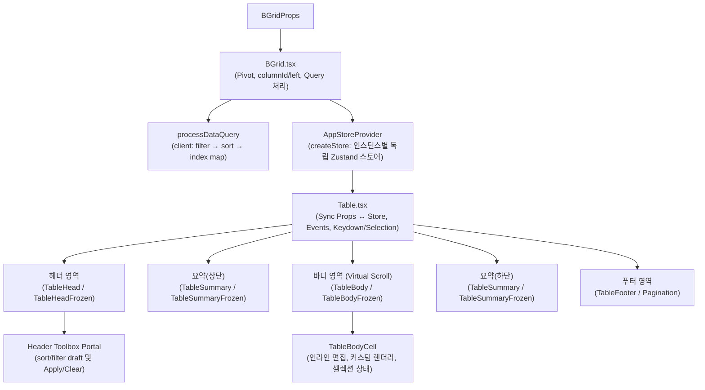

# `beautiful-grid` 프로젝트 코드 분석 보고서

## 1. 프로젝트 개요 및 기술 스택

`beautiful-grid`는 대용량 데이터 처리와 다양한 엔터프라이즈 그리드 기능을 지원하는 고성능 React 데이터그리드 라이브러리입니다.

### 핵심 기술 스택
- **Core Library**: React 19 (`peerDependencies: ^19.2.0`), TypeScript 4.8+
- **State Management**: [Zustand](https://github.com/pmndrs/zustand) 4.5.7 (인스턴스별 독립 스토어 컨텍스트 구조)
- **Library Styling**: 정적 `style.css`, `bgrid-*` 클래스, `--bgrid-*` CSS 변수. 런타임 CSS-in-JS 의존성 없음
- **Demo Styling**: Tailwind CSS 3.4와 Ant Design은 Vite 데모 앱에서만 사용
- **Interactions & Drag**: SortableJS 1.15.3 (컬럼 드래그 재정렬)
- **Build Tools**: Vite 5.4 (데모 앱 번들링), `tsc` (CJS / ESM / Types 멀티 타깃 빌드)
- **Test Suite**: Vitest 2.1.9, Happy-DOM, Testing Library React, Playwright 1.54

---

## 2. 디렉토리 및 파일 구조

```
beautiful-grid/
├── beautiful-grid/               # 📦 배포 라이브러리 소스코드
│   ├── BGrid.tsx              # 공개 컴포넌트 진입점 (Provider 및 초기 props 처리)
│   ├── index.tsx                   # 패키지 익스포트 진입점
│   ├── types.ts                    # 공용/내부 전체 타입 정의 (Single Source of Truth)
│   ├── style.css                   # 배포용 정적 스타일 및 --bgrid-* 디자인 토큰
│   ├── components/                 # 순수 UI 렌더링 및 하위 컴포넌트
│   │   ├── Table.tsx               # 테이블 오케스트레이터 및 이벤트/셀렉션 제어
│   │   ├── TableHead.tsx / TableHeadFrozen.tsx     # 일반/틀고정 헤더 렌더러
│   │   ├── TableBody.tsx / TableBodyFrozen.tsx     # 가상 스크롤 일반/틀고정 바디 렌더러
│   │   ├── TableBodyCell.tsx       # 바디 셀 렌더러 (편집/스타일/클릭 처리)
│   │   ├── TableSummary.tsx / TableSummaryFronzen.tsx # 집계(Summary) 렌더러
│   │   ├── TableFooter.tsx / Pagination.tsx        # 푸터 및 페이지네이션
│   │   ├── ColResizer.tsx          # 컬럼 너비 조절 인터랙션
│   │   ├── RowSelector.tsx         # 체크박스/라디오 셀렉터
│   │   ├── toolbox/                # 헤더 Toolbox Portal, 정렬/필터/커스텀 섹션
│   │   └── Loading.tsx / GripVertical.tsx
│   ├── store/
│   │   └── createAppStore.tsx      # Zustand 스토어 팩토리 및 컨텍스트 Provider
│   └── utils/                      # 유틸리티 함수군
│       ├── useBodyData.ts          # 가상 스크롤 가시 영역 계산 & 셀 병합 캐시
│       ├── createPivotData.ts      # 피벗 데이터 변환 알고리즘
│       ├── getColumnId.ts          # Query에 사용하는 안정적 컬럼 ID 생성
│       ├── filterData.ts           # 컬럼별 필터 predicate 실행
│       ├── processDataQuery.ts     # client filter → stable sort 및 source index map
│       ├── updateDataQuery.ts      # 불변 Query 갱신
│       ├── mouseEventSubscribe.ts  # 마우스 드래그/리사이즈 구독 헬퍼
│       └── getCellValue.tsx / getFrozenColumnsWidth.ts / common.ts
├── examples/                       # 데모 및 기능별 예제 코드
├── test/                           # Vitest 유닛/통합 테스트
├── e2e/                            # Playwright E2E 테스트
├── scripts/                        # dist 패키징 및 배포 헬퍼 스크립트
└── tsconfigs/                      # CJS, ESM, Types 빌드용 tsconfig 모음
```

---

## 3. 아키텍처 및 핵심 데이터 흐름



### 1) 격리형 Zustand 스토어 패턴
- 전역 스토어를 사용하지 않고, `AppStoreProvider` 내부에서 `useRef` + `createStore`를 통해 매 `<BGrid>` 인스턴스마다 고유한 Zustand 스토어를 생성합니다.
- 복수의 그리드가 한 화면에 렌더링되어도 상태 오염이 전혀 발생하지 않습니다.
- 성능 최적화를 위해 `Table.tsx` 및 하위 컴포넌트에서 `useShallow`를 활용한 그룹별 셀렉터를 분리하여 불필요한 리렌더링을 방지합니다.

### 2) 컬럼 좌표(`left`) 사전 계산 (Pre-computed Column Offset)
- `BGrid.tsx`에서 렌더링 전 컬럼들의 좌측 누적 좌표(`left`)를 일괄 계산합니다.
- `frozenColumnIndex` 미만의 고정 컬럼은 `left: -1` (센티넬 값)로 지정되어 별도의 Frozen 컴포넌트에서 렌더링됩니다.

### 3) 고성능 가상 스크롤 (Virtual Scrolling)
- 수만 건 이상의 대용량 데이터도 DOM 노드를 최소화하여 부드럽게 렌더링합니다.
- **수직 가상화**: `useBodyData.ts` 및 `TableBody.tsx`에서 `scrollTop`과 행 높이(`trHeight`)를 기반으로 현재 뷰포트에 필요한 시작 인덱스(`startIdx`)부터 표시 개수(`displayItemCount`)만큼 슬라이싱(`data.slice`)하여 렌더링합니다.
- **수평 가상화**: `scrollLeft` 및 현재 가시 너비를 계산하여 화면에 노출되는 컬럼 범위(`startCIdx` ~ `endCIdx`)를 산출합니다.
- 스크롤 동기화 시 `requestAnimationFrame`을 적용해 브라우저 렌더링 프레임과 싱크를 맞춥니다.

### 4) Query Controller와 원본 행 매핑

- 적용된 Query의 Source of Truth는 소비자가 전달하는 `dataControl.query`다. Store에는 렌더링을 위해 미러링하고, Toolbox의 편집 중 필터만 `filterDrafts`에 둔다.
- `manual` 모드는 Query 변경만 통지하고 데이터를 가공하지 않는다. `client` 모드는 `sourceData`에 필터 후 stable multi-sort를 적용한다.
- 처리 결과는 `sourceIndexByVisibleIndex`와 `visibleIndexBySourceIndex`를 함께 생성하여 필터 후 클릭, 편집, 체크 콜백이 원본 행 인덱스를 사용할 수 있게 한다.
- `column.key`는 값 접근 경로이고 `column.id`/생성 `columnId`는 Query 식별자다. 중첩 값은 `getCellValueByRowKey`로 읽는다.
- Pivot 활성 상태에서는 기본 Toolbox/dataControl 경로를 비활성화한다.

---

## 4. 주요 기능 모듈 분석

| 기능 | 주요 파일/함수 | 동작 메커니즘 |
|---|---|---|
| **데이터 모델 래퍼** | `types.ts: BGridDataItem<T>` | 원본 객체를 `{ values: T, status, checked, meta }` 구조로 래핑하여 행 상태를 불변성 유지하며 추적 |
| **틀고정 컬럼 (Frozen)** | `TableHeadFrozen.tsx`, `TableBodyFrozen.tsx` | `frozenColumnsWidth`만큼의 독립 뷰포트를 절대 위치(`position: absolute`)로 헤더/바디 좌측에 고정 렌더링 |
| **셀 병합 (Cell Merge)** | `useBodyData.ts: computeMergeRowSpans` | `mergeBy` 기준으로 연속된 동일 값을 감지하여 `rowSpan` 산출. `WeakMap`을 활용한 구간 캐싱으로 스크롤 성능 유지 |
| **셀 선택 & 복사** | `Table.tsx: copySelectedCells` | 마우스 드래그, Shift/Ctrl/Cmd 다중 범위 선택, 오토 스크롤 지원 및 TSV 포맷 클립보드 복사 (`Clipboard API` + Fallback) |
| **인라인 셀 편집** | `TableBodyCell.tsx`, `useEditorGrid.tsx` | `click` 또는 `dblclick` 트리거로 편집 모드 전환. 방향키/Tab을 통한 포커스 이동 (`handleMove`), 저장/취소 지원 |
| **피벗 테이블** | `createPivotData.ts` | 행/열/값 필드 정의를 기반으로 데이터를 다차원 버킷팅하고 `sum`, `avg`, `count`, `min`, `max`, 커스텀 집계함수를 적용해 피벗 그리드 스키마로 즉시 변환 |
| **컬럼 리사이즈 & 정렬** | `ColResizer.tsx`, `SortableJS` | 마우스 드래그를 통한 실시간 컬럼 너비 조정(틀고정 영역 계산 포함) 및 컬럼 순서 드래그 앤 드롭 재정렬 |
| **요약 / 합계 행** | `TableSummary.tsx` | `summary.position`('top' \| 'bottom')에 따라 컬럼별 집계 렌더러 실행 |
| **Header Toolbox** | `TableHeadColumn.tsx`, `components/toolbox/*` | 일반/Frozen 헤더의 Portal 팝오버에서 정렬, 값/문자열/숫자 필터, 커스텀 메뉴를 조작 |
| **Query 처리** | `filterData.ts`, `processDataQuery.ts`, `updateDataQuery.ts` | 제어 Query 불변 갱신, client filter → stable sort, 표시/원본 index map 생성 |

---

## 5. 빌드 및 테스트 파이프라인

### 빌드 프로세스 (`npm run build:library`)
1. **Clean**: `dist/` 초기화
2. **Style**: 정적 `beautiful-grid/style.css`를 `dist/style.css`로 복사
3. **CJS / ESM / Types**: 각각 별도의 `tsconfigs/` 설정으로 다중 번들 및 `.d.ts` 타입 정의 생성
4. **Manifest**: `scripts/create-dist-package-json.mjs`를 실행하여 `dist/package.json`, `README.md`, `LICENSE` 복사 및 엔트리포인트 매핑

### 테스트 파이프라인
- **Unit & Integration**: Vitest (`npm test`) — 2026-08-17 기준 6개 파일, 108개 테스트 통과
- **Consumer Contract**: `npm run test:library:consumers` — CJS, ESM, Types 설치 소비 검증
- **CSS Contract**: `npm run test:library:css` — `dist/style.css` 존재, 금지된 런타임 스타일 의존성, 필수 selector 검사
- **E2E Test**: Playwright (`npm run test:e2e`) — 2026-08-17 기준 Chromium 24개 테스트 통과

Toolbox 테스트는 기본 렌더링과 filter Apply 외에도 custom comparator desc, 필터 상태의 checkedAll, 활성 Query의 reorder 차단, 외부 Query 동기화, 숫자 invalid draft, duplicate/unknown ID, 일반/Frozen/그룹 헤더, Portal cleanup과 키보드 포커스 수명주기를 검증한다. 상세 감사 결과는 `docs/header-toolbox-plan.md`를 따른다.

---

## 6. 분석 요약 및 인사이트

1. **높은 유연성과 성능의 균형**: 가상 스크롤, `WeakMap` 캐싱, Zustand 셀렉터 세분화를 통해 대량 데이터에서도 프레임 드랍 없는 렌더링 구조를 갖추고 있습니다.
2. **명확한 모듈 분리**: 피벗 변환(`createPivotData`), 스크롤 데이터 계산(`useBodyData`), 마우스 이벤트 구독(`mouseEventSubscribe`)이 독립 모듈로 철저히 캡슐화되어 있어 유지보수 및 확장이 용이합니다.
3. **확장된 데이터 제어 계층**: 기존 정렬 API와 별도로 `dataControl.query`를 도입해 정렬과 필터를 통합했으며, client/manual 모드를 분리했습니다. 초기 구현 감사에서 확인된 P1/P2 항목은 회귀 테스트와 함께 보완했습니다.
